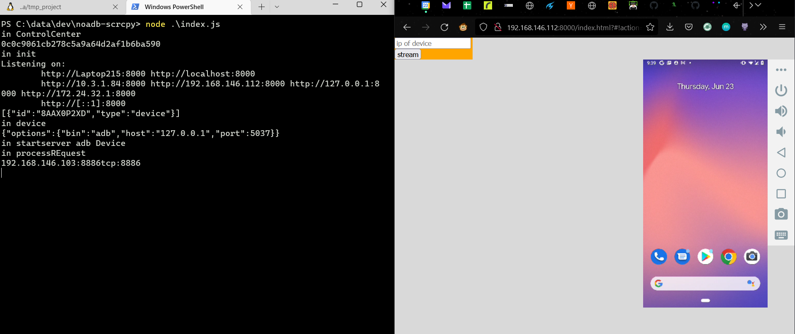

# noadb-scrcpy
A patch to [`ws-scrcpy`](https://github.com/NetrisTV/ws-scrcpy) to accept remote websocket from device without the need for ADB. 

#
# Run
```
0. to device: "adb push vendor\Genymobile\scrcpy\scrcpy-server.jar /data/local/tmp"
1. on device: "CLASSPATH=/data/local/tmp/scrcpy-server.jar app_process / com.genymobile.scrcpy.Server 1.19-ws2 web DEBUG 8886" (on telnetd shell session for example or run as init.rc service on rooted device) 
2. on host computer: node index.js
3. on created webserver application: put device ip and stream
```
